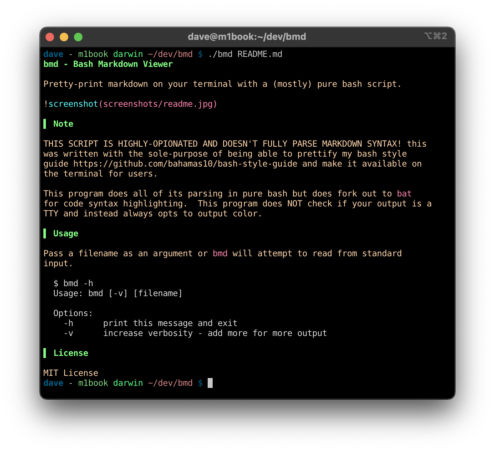

bmd - Bash Markdown Viewer
==========================

Pretty-print markdown on your terminal with a (mostly) pure bash script.



Note
----

THIS SCRIPT IS HIGHLY-OPIONATED AND DOESN'T FULLY PARSE MARKDOWN SYNTAX! this
was written with the sole-purpose of being able to prettify my bash style
guide https://github.com/bahamas10/bash-style-guide and make it available on
the terminal for users.

This program does all of its parsing in pure bash but does fork out to `bat`
for code syntax highlighting.  This program does NOT check if your output is a
TTY and instead always opts to output color.

Usage
-----

Pass a filename as an argument or `bmd` will attempt to read from standard
input.

```
$ bmd -h
Usage: bmd [-v] [filename]

Options:
  -h      print this message and exit
  -v      increase verbosity - add more for more output
```

License
-------

MIT License
